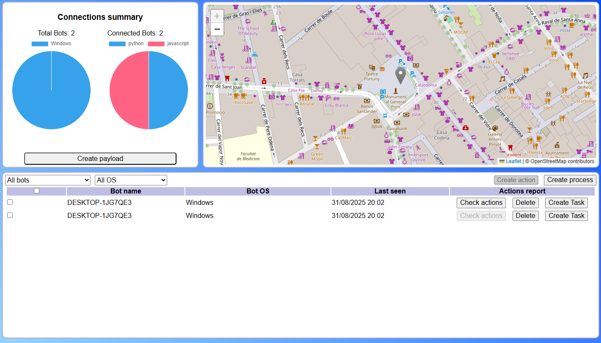

# Bot Commander 🤖
**A modular administrator that gives you the power to control a list of bots, generate more with payloads, and use tools to control and monitor them.**

[](LICENSE)
[](https://github.com/flautarian/bot-commander/issues)
[](https://github.com/flautarian/bot-commander/stargazers)
[](https://www.python.org/)
[](https://www.oracle.com/)
[](https://www.w3schools.com/js/js_2024.asp)


## 📌 **Description**

Bot Commander is a fully dockerized system that serves as the core for bot connections, functioning as the backbone of a botnet system. Its infrastructure can track each bot using a heartbeat system, send commands for execution, and receive the results of those commands.


## 🚀 **Features**

- **Modularity**: The system is dockerized, allowing for modular activation and deactivation of modules based on user preferences.

- **Multi language**: Available in English and Spanish.

- **Bot control**: Tracks all connected bots and includes a payload generator for easy bot creation.

- **Easy deployment**: The Docker system ensures simple deployment on any server of your choice.

- **Bot commands**: Send commands to individual bots or groups, depending on the use case.

- **Customized processes**: A process system enables the creation of complex command sequences and easy block execution.

- **Multi payload generator**: The frontend can generate payloads to create bots that connect to the service online in two languages (Python 🐍 and JavaScript 📜).

- **Bot screenshot**: Includes a command to capture and send screenshots from the bot's system.

- **Bot geolocation**: Includes a command to retrieve the bot's current geolocation (intentionally unimproved to prevent abuse).

---

## 🛠️ **Instalation**

Clone the repository to your server and start the Docker system with:

``` bash
docker compose up
```

This command will download all necessary Docker images and set up the program, distributed across 5 dockerized modules:


### 🖥️ **Frontend**

An Angular 17 frontend that provides a Single Page Application (SPA) for users to control and monitor connected bots. It offers:

- A list of connected bots with charts.
- Geolocation of each bot.
- Saved processes in the database.
- Tasks assigned to bots and their results.
- The ability to send tasks to bots for execution.
- The ability to create complex processes for later execution on bots.





### 📌 **Backend**

A Spring Boot Java backend that serves as the core of the administration system. It manages data flow to the frontend via WebSocket messages, interacts with MongoDB using Spring Boot drivers and streaming requests, and communicates with bots using the Kafka message broker.


### 📶 **Kafka and zookeeper**

These modules manage the connection between bots and the backend, enabling:

- Initialization messages of unregistered bots.
- Command messages to bots.
- Callback messages of command results.
- Heartbeat messages.

### 💾 **Database**

A MongoDB database that stores all bot-related information:

- Bot registration
    - Bot information
    - Heartbeat status
    - Sent commands
    - Command result information

- Processes
    - Process information
    - Command lists


## ⚠️ **Disclaimer / Legal Notice**

**This software has been developed for educational and learning purposes** as part of a student project. Its use is the sole responsibility of the end user.

- **We are not responsible** for misuse, abuse, or any consequences arising from the use of this program.
- **We do not guarantee** that the software is free from errors, vulnerabilities, or suitable for any specific use case.
- **Its use in production environments is not recommended** without prior review and adaptation by professionals.
- **The author and contributors** assume no legal liability for damages, losses, or issues caused by the use (or misuse) of this software.

**By using this project, you agree to these terms and acknowledge that you do so at your own risk.**

---